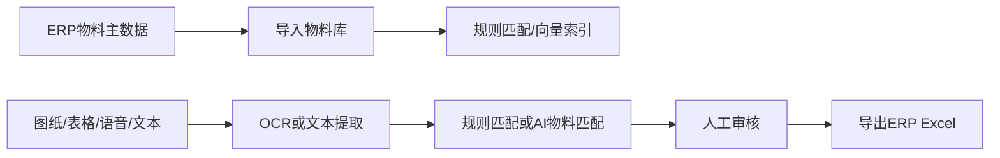
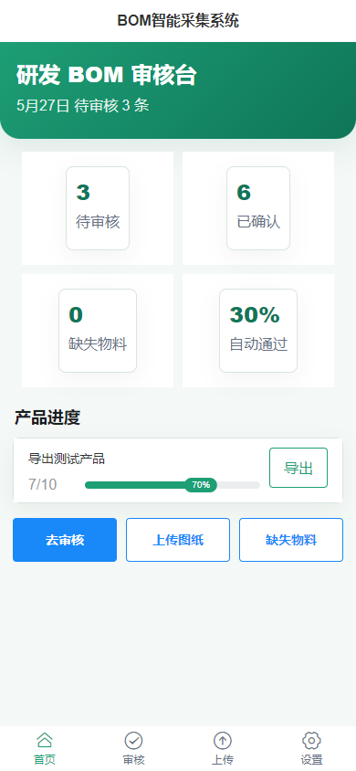
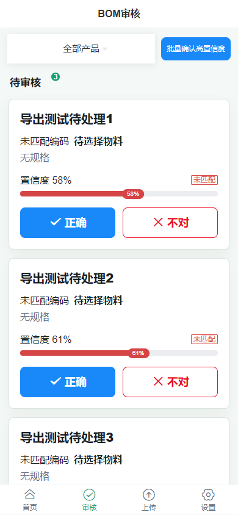
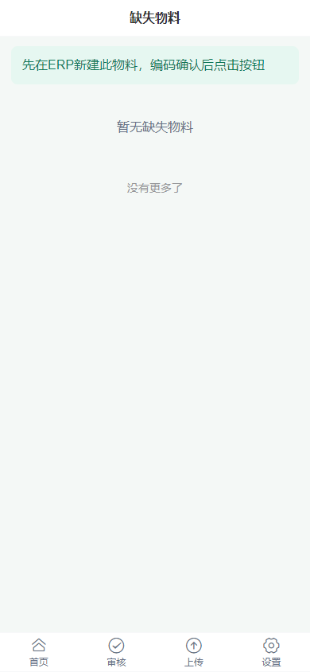
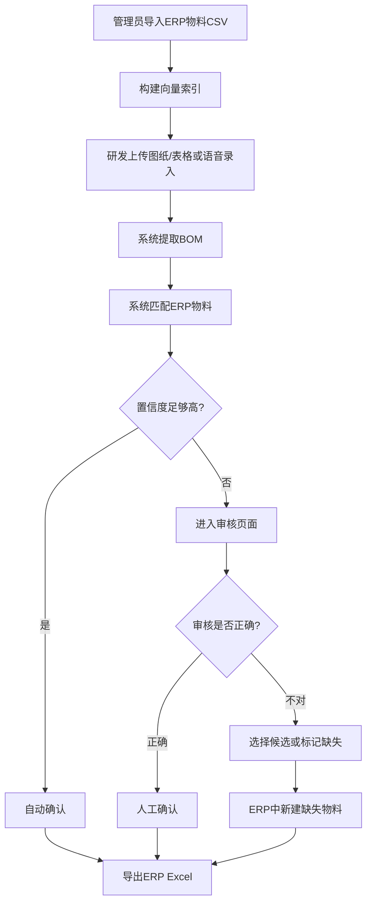

# BOM智能采集系统图文使用说明

本文面向现场实施人员、研发审核员和系统管理员，说明系统怎么用，以及哪些功能是必须的、哪些功能需要配置后才能使用、哪些属于可选增强。

## 一、系统用来做什么

BOM智能采集系统把研发人员的图纸、表格、口述内容转换成ERP可导入的BOM清单。



最常见流程：

1. 管理员先导入ERP物料。
2. 系统默认使用规则匹配；如果启用AI，管理员再构建物料向量索引。
3. 研发人员上传图纸、表格或口述BOM。
4. 系统自动识别并匹配物料。
5. 审核员确认、不对则选择候选或标记缺失。
6. 确认完成后导出ERP导入Excel。

## 二、功能分级说明

| 类型 | 功能 | 所属模块 | 是否必须 | 说明 |
| --- | --- | --- | --- | --- |
| 基础运行 | 项目启动、SQLite数据库、API统一返回 | M1 | 必须 | 没有它系统不能运行 |
| 物料基础 | ERP物料CSV导入 | M2 | 必须 | 匹配前必须先有物料主数据 |
| 物料基础 | 规则匹配 | M4 | 必须 | 不依赖AI，适合先上线使用 |
| 物料基础 | FAISS向量索引构建 | M2 | 需要配置 | AI语义匹配依赖索引和 embedding 接口 |
| 图纸识别 | PaddleOCR本地识别 | M3 | 必须 | 免费本地图纸识别能力 |
| 表格识别 | 百度OCR表格识别 | M3 | 需要配置 | 适合老BOM表格截图；需要百度OCR密钥和免费额度 |
| AI提取 | GPT结构化提取BOM | M3 | 需要配置 | 需要开启AI并配置可用接口 |
| AI匹配 | 向量匹配、GPT判断 | M4 | 需要配置 | 需要开启AI、配置聊天模型和向量模型 |
| 系统配置 | 前端设置页维护AI开关和模型 | M5/M6 | 必须 | 不用改代码即可切换规则模式和AI增强模式 |
| 审核协作 | 待审核列表、确认、拒绝、改派、日志 | M5/M6 | 必须 | 研发人员主要使用入口 |
| 导出 | ERP标准Excel导出 | M7 | 必须 | 最终交付ERP导入文件 |
| 语音录入 | 浏览器语音转文字 | M8 | 可选 | Chrome/Edge效果最好；可降级为手动文本输入 |
| 安全 | API Key鉴权 | M5 | 生产需要 | 开发环境可不配置；生产建议配置 `API_KEY` |
| 部署 | docker-compose | 整合 | 可选 | 便于服务器部署 |

## 三、首次使用前准备

### 1. 配置 `.env`

从 `.env.example` 复制一份 `.env`。

必须关注：

- `DATABASE_URL`：默认即可，使用 SQLite。
- `AI_ENABLED`：默认 `false`，规则模式可直接运行。
- `OPENAI_API_KEY`：需要AI提取、向量索引、语义匹配时填写，也可以在前端设置页保存。
- `OPENAI_BASE_URL`：使用OpenAI兼容中转站时填写；不用中转站时留空。
- `OPENAI_CHAT_MODEL`：聊天/推理模型，默认 `gpt-4o-mini`，使用当前中转站可填 `gpt-5.5`。
- `OPENAI_EMBEDDING_MODEL`：向量模型，默认 `text-embedding-3-small`。
- `EMBEDDING_PROVIDER`：向量供应商，可填 `openai`、`dashscope`、`qianfan`。

按需配置：

- `BAIDU_OCR_API_KEY`、`BAIDU_OCR_SECRET_KEY`：需要百度表格OCR时填写。
- `DASHSCOPE_API_KEY`：需要阿里百炼 `text-embedding-v4` 时填写。
- `QIANFAN_API_KEY`：需要百度千帆 `embedding-v1` 时填写。
- `API_KEY`：生产环境建议填写，填写后前端设置页也要填同一个密钥。

如果使用中转站API：

```env
OPENAI_API_KEY=你的中转站密钥
OPENAI_BASE_URL=https://你的中转站域名/v1
OPENAI_CHAT_MODEL=gpt-5.5
OPENAI_EMBEDDING_MODEL=text-embedding-3-small
```

中转站需要兼容OpenAI接口，并支持你填写的聊天模型和向量模型。聊天模型不能替代向量模型，物料匹配索引仍需要 embedding 模型。

国内向量服务推荐在前端「设置」页选择：

- `兼容接口`：适合 OpenAI 或支持 `/v1/embeddings` 的中转站。
- `阿里`：使用阿里百炼 DashScope 原生接口，默认 `text-embedding-v4`。
- `百度`：使用百度千帆 v2 embeddings 接口，默认 `embedding-v1`。

切换向量服务后，需要到「物料」页重新点击「重建AI匹配索引」，否则旧索引仍是上一次模型生成的向量。

### 2. 在前端设置运行模式

打开底部「设置」页：

- 关闭「AI增强能力」：系统使用规则提取和本地匹配，适合没有可用AI接口时先上线。
- 开启「AI增强能力」：填写接口地址、接口密钥、聊天模型、向量模型后保存。
- 向量服务可选「兼容接口」「阿里」「百度」，国内现场优先试阿里或百度。
- 接口密钥保存后只显示已配置，不会明文回显。
- 如果AI调用失败，上传和匹配流程会尽量降级到规则模式，不让审核流程中断。

### 3. 启动后端

```bash
cd backend
.\.venv\Scripts\python.exe -m uvicorn main:app --reload --host 127.0.0.1 --port 8000
```

接口文档地址：

```text
http://127.0.0.1:8000/docs
```

### 4. 启动前端

```bash
cd frontend
pnpm dev --host 127.0.0.1 --port 5173
```

前端地址：

```text
http://127.0.0.1:5173
```

## 四、页面说明

### 1. 首页仪表盘



首页用于查看整体进度：

- 待审核：还需要人工确认的BOM条目。
- 已确认：可以进入ERP导出的条目。
- 缺失物料：ERP中暂时没有，需要先新建。
- 自动通过率：系统自动确认的比例。
- 产品进度：每个产品的确认进度。
- 导出：下载某个产品的ERP Excel。

什么时候用：

- 每天查看还有多少待审核。
- 某个产品审核完成后点「导出」。

### 2. 上传图纸或Excel


使用步骤：

1. 输入产品名称，例如 `主控板V2`。
2. 选择「文件上传」。
3. 点击上传区域，选择图片、截图或Excel。
4. 等待识别完成。
5. 检查识别预览。
6. 点击「确认提交审核」。

注意：

- 图片尽量清晰、正向、不要严重反光。
- 表格截图建议使用百度OCR模式，但需要先配置百度OCR密钥。
- 当前上传页会自动进入识别和BOM结构提取。

### 3. 语音录入


使用步骤：

1. 输入产品名称。
2. 切换到「语音录入」。
3. Chrome或Edge中，长按绿色麦克风说话，松开结束。
4. 检查识别文字，可以手动修改。
5. 点击「提交识别」。
6. 提取完成后继续「确认提交审核」。

推荐口述方式：

```text
主控板V2，需要铜柱M3乘6四个，主控芯片STM32F103一个，电容100uF贴片十个。
```

注意：

- 浏览器语音识别是免费方案，识别效果取决于浏览器和现场环境。
- Chrome/Edge效果最好。
- iOS Safari支持有限，系统会降级为文本输入。
- 若要更高准确率，后续可扩展 Whisper API 音频转写。

### 4. 审核页面



审核员主要看这个页面。

每张卡片包含：

- 原始叫法：研发人员或图纸里的叫法。
- 系统匹配结果：系统猜测对应的ERP物料。
- 置信度：越高越可信。
- 匹配方式：精确、语义、AI推断或未匹配。
- 「正确」：确认系统匹配无误。
- 「不对」：打开候选列表，改选其他物料或标记缺失。

推荐判断规则：

- 置信度 `90%` 以上：通常可以快速确认。
- 置信度 `70% - 89%`：建议人工看一眼。
- 置信度低于 `70%` 或未匹配：重点检查，可能是缺失物料。

### 5. 缺失物料页面



缺失物料表示系统没有在ERP物料库中找到合适物料。

处理步骤：

1. 在缺失物料页查看研发叫法和AI建议。
2. 先到ERP中新建该物料。
3. ERP中拿到正式编码后，再回系统处理审核或后续改派。
4. 已经在ERP新建的，可以点击「已在ERP新建」标记状态。

## 五、管理员操作

### 1. 导入ERP物料

前端入口：

```text
底部「物料」 → 上传ERP物料CSV → 导入或更新物料库
```

CSV列名必须为：

```text
编码,名称,规格,单位,类别
```

这些数据就是系统和研发叫法做对比的“标准商品/物料底库”。研发上传图纸或语音后，系统会拿识别出的原始叫法到这里做精确匹配、规则匹配和AI语义匹配。

接口：

```text
POST /api/materials/import
```

### 2. 构建向量索引

导入物料后必须构建索引，否则语义匹配不可用。

前端入口：

```text
底部「物料」 → 重建AI匹配索引
```

如果当前关闭AI增强能力，系统仍可用规则模式匹配；开启AI后，导入新物料建议立即重建索引。

接口：

```text
POST /api/materials/build-index
```

### 3. 查看接口文档

```text
http://127.0.0.1:8000/docs
```

## 六、导出ERP Excel

导出文件包含4个Sheet：

| Sheet | 内容 | 谁看 |
| --- | --- | --- |
| BOM导入表 | 已确认BOM，ERP标准格式 | ERP导入人员 |
| 待处理项 | pending和rejected条目 | 审核员 |
| 需新建物料 | 缺失物料队列 | 物料管理员 |
| 操作日志 | 审核和改派记录 | 管理员 |

只会把 `confirmed` 状态的条目放入「BOM导入表」。

## 七、哪些功能没有配置会受影响

| 未配置项 | 影响 |
| --- | --- |
| `OPENAI_API_KEY` | 兼容接口的GPT提取、向量生成、LLM判断不能真实调用；本地e2e脚本仍可离线验收 |
| 阿里/百度向量密钥 | 对应国内向量供应商不能构建FAISS索引；可改回兼容接口或规则模式 |
| 百度OCR密钥 | `mode=baidu` 不可用；普通PaddleOCR仍可用 |
| `API_KEY` | 不影响开发；生产环境少一层接口保护 |
| 未导入ERP物料 | 无法做有效匹配 |
| 未构建FAISS索引 | 语义匹配效果受影响 |

## 八、推荐现场流程



## 九、常见问题

### 上传后识别失败

先检查图片是否清晰、后端是否启动、`OPENAI_API_KEY` 是否配置。表格截图可以尝试百度OCR模式。

### 语音按钮没有效果

优先使用 Chrome 或 Edge，并允许浏览器使用麦克风。Safari支持有限时，请直接在文本框里输入。

### 为什么有些物料进了缺失物料

通常是ERP物料库里没有对应名称或规格，也可能是研发叫法和ERP名称差异太大。先在ERP确认是否已有物料。

### 为什么导出的BOM导入表少了几行

只有 `confirmed` 状态会进入「BOM导入表」。待审核和拒绝项会放在「待处理项」Sheet。

### 端到端验收怎么跑

```bash
.\backend\.venv\Scripts\python.exe .\scripts\e2e_test.py
```

该脚本不消耗OpenAI费用，会用确定性测试数据模拟完整流程。
